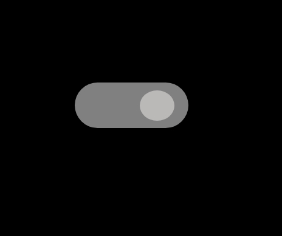

# JavaScript Mini Projects

Welcome to my **JavaScript Mini Projects Repository**.
This repo contains **14  creative mini projects** built using **HTML, CSS, and JavaScript**.
Each project focuses on improving **logic building**, **DOM manipulation**, and **real-world functionality**.

---

## Skills & Technologies Used

- **HTML5** -> Structure of each project
- **CSS3** -> Styling and layouts (responsive where needed)
- **JavaScript (ES6+)** -> Core functionality, DOM manipulation, events

---

## Key Features

- **14 Mini Projects** for hands-on practice
- Strengthen your **logic building** & **problem-solving** Skills
- Includes interactive features like theme switching & color generators
- Beginner-friendly codebase

---

## Project Screenshots

| Project Name                             | Preview |
|------------------------------------------|---------|
| Calculator                               |  |
| Counter App                              |  |
| Dark / Light Theme                       |  |
| Dynamic List Items                       |  |
| form Card                                |  |
| Form Validation                          |  |
| Live Character Counter                   |  |
| Multi Color Background                   |  |
| Random Color Generator                   |  |
| Stopwatch                                |  |
| String Magic Box                         |  |
| Theme Change                             |  |
| Time & Interval Download                 |  |
| Toaster Notification                     |  |

> Place all screenshot inside the `Projects-Screenshot` folder.

---

## How to Use

1. Download or clone this repository
2. Open the folder of any project
3. Double-click on `index.html` to open it in your brower
